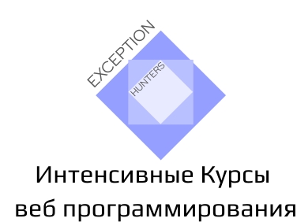

# lesson-16

  

 

# Что будем делать (12 августа 2020)
1) Продолжим верстать "Super Host"

# Что сделали сегодня
1) Продолжили верстать "Super Host" (продолжили секцию 'intro')

# Ключевые моменты урока
1) Для того что-бы задать бордюр мы прописываем: 
<pre>
  border: 3px solid #fff;
</pre>
Данная запись является сокращенной записью полной записи которая выглядит вот так 
<pre>
  border-width: 3px;
  border-style: solid;
  border-color: #fff;
</pre>
Мы будем пользоваться сокращенной записью. Важно знать, мы либо все используем значения для бордюра - либо ни каких. Если использовать только лишь одно, например  
<pre>
  border-width: 3px; 
</pre>
то поведение может быть непредсказуемым

 
 
 

  
  
  
  
  
  
  
  
  

